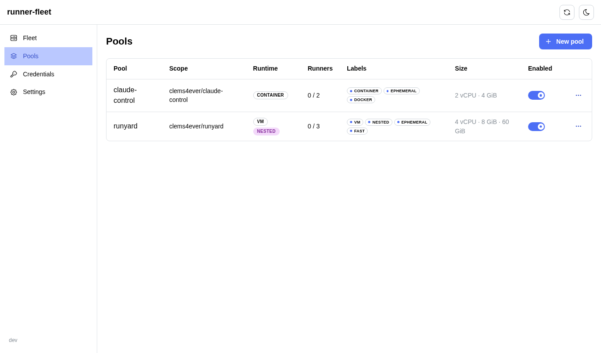
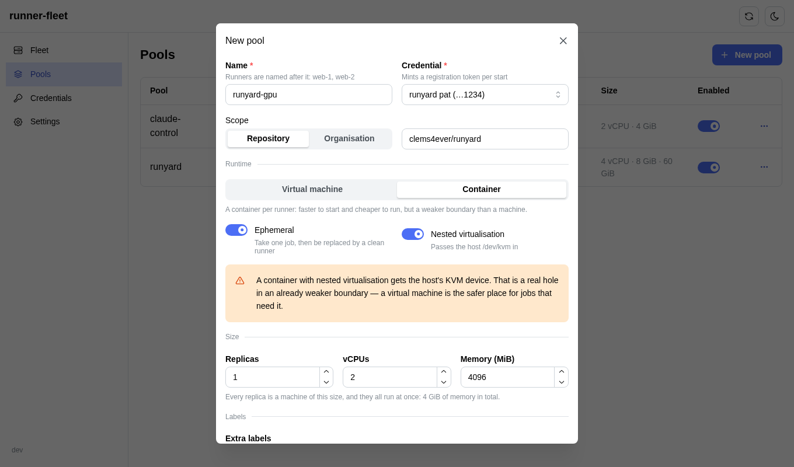
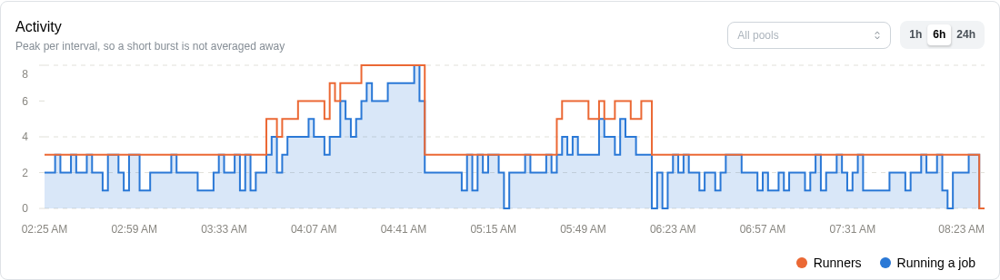
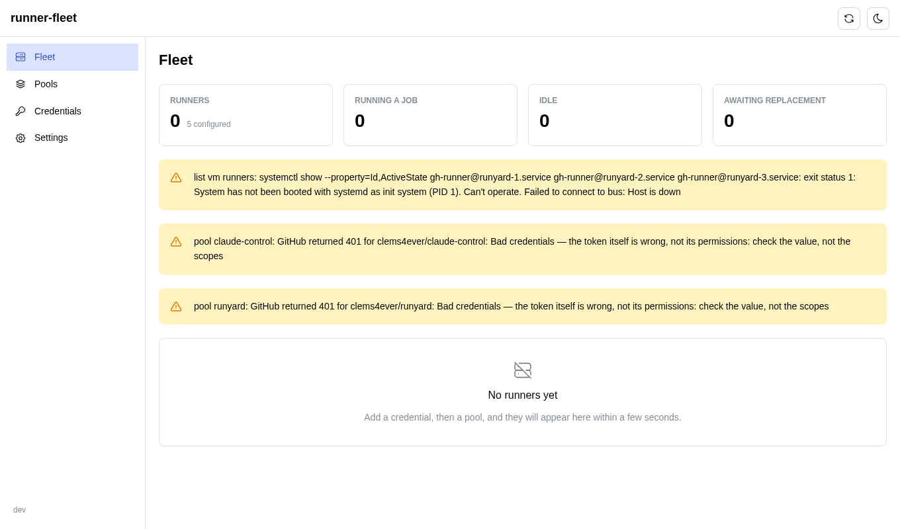
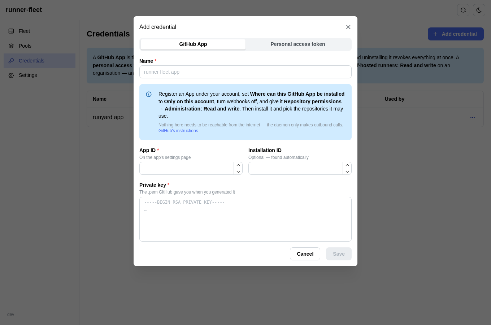

# runner-fleet

[](https://github.com/clems4ever/github-runner/actions/workflows/ci.yml)

A daemon that maintains a fleet of [self-hosted GitHub Actions
runners](https://docs.github.com/en/actions/hosting-your-own-runners) on one
host, with a web UI to configure it.

Each runner is a throwaway QEMU virtual machine or a Docker container. Per pool
you choose the repository or organisation, the runtime, whether jobs get
`/dev/kvm`, whether runners are ephemeral, what labels they register with, how
big they are — and how far the pool may scale itself when work arrives.

**Upgrading the daemon does not touch the runners.** It supervises nothing: the
runners are systemd units and Docker containers of their own, and the daemon
only creates, drains and deletes them. Restart it, upgrade it, or let it crash —
the jobs on this host carry on.



## Install

```bash
curl -fsSL https://raw.githubusercontent.com/clems4ever/github-runner/main/install.sh | sudo bash
```

It fetches the latest release, verifies its checksum, installs the systemd
unit, and asks for the user name and password the web UI will use. Then open
<http://127.0.0.1:8080>.

Rerunning it is how you upgrade, and it is deliberately uneventful.

The UI binds to the loopback address. If the host is remote, tunnel to it rather
than opening the port — the daemon holds a credential that administers your
repositories:

```bash
ssh -N -L 8080:127.0.0.1:8080 your-host
```

## Getting started

1. **Add a credential** — a GitHub App, or a personal access token. Either
   needs **Administration: Read and write** on the repositories it covers, or
   **Self-hosted runners: Read and write** on an organisation, and either is
   encrypted at rest and never shown again.
2. **Create a pool.** Pick the scope, the runtime, and the number of replicas.
3. Runners appear within a few seconds, and again after a reboot.

A pool named `web` with a maximum of three gives you `web-1`, `web-2` and
`web-3` when it is busy, and just `web-1` when it is not.

## What a pool decides

| | |
| --- | --- |
| **Scope** | one repository, or an organisation whose repositories all share the runners |
| **Runtime** | a virtual machine per job, or a container |
| **Nested virtualisation** | whether jobs get `/dev/kvm` and can boot machines of their own |
| **Ephemeral** | take one job, then be replaced by a clean runner |
| **Minimum runners** | what the pool keeps up when nothing is running, at least one |
| **Maximum runners** | how far it may grow under load; equal to the minimum for a fixed size |
| **Labels** | what a workflow targets with `runs-on` |
| **Size** | vCPUs, memory, and disk for VM pools |

Every runner also registers with labels describing what it is — `vm` or
`container`, plus `nested` and `ephemeral` when they apply — so a workflow can
ask for what it needs:

```yaml
jobs:
  build:
    runs-on: [self-hosted, nested]
```

Those follow the settings rather than the name, so a pool cannot claim to be
something it is not.



### Autoscaling

Set the minimum to 1 and the maximum to 5, and the pool sits at one idle runner
until work arrives.

**Growing.** GitHub does not publish how many jobs are queued for a set of
labels — only what each runner is doing. So demand is inferred: when *every*
runner in a pool is busy, the next job would have nowhere to go, and one more
runner is added. That is also why the minimum is never zero. A pool with no
runners has nothing to observe, so it could never learn that it should grow;
the idle runner is what makes the pool able to answer the question at all.

It grows one runner at a time, and the daemon comes back within seconds after a
scale-up rather than waiting for its next tick, so a burst ramps quickly without
a single long job conjuring a full fleet.

**Shrinking** is deliberately the slow direction. The pool returns to its
minimum only after five minutes with nothing busy, which rides out the gap
between one job and the next. Shrinking drains like every other change, and it
picks idle runners: a runner with a job on it is kept, not stopped and waited
on.

Minimum equal to maximum is a fixed-size pool that never moves — which is what
every pool was before this existed, and what an upgraded database keeps.

The fleet view says which pool is at what size and why: *every runner is busy*,
*quiet for 7m*, *spare capacity available*.

### Activity

The daemon records what it observed on every pass and keeps two days of it, so
the fleet view can show what has been happening rather than only what is
happening now. The filled area is work actually running; the line above it is
how many runners existed to run it — one axis, both counting runners — so a
pool scaling up reads as the line stepping out to meet the area, and settling
back when the work stops.



Each point is the **peak** of its interval, not the mean: a burst that filled
the fleet for two minutes is the thing worth seeing, and averaging over a
ten-minute bucket would flatten it into nothing. Narrow it to a single pool
with the filter, or leave it on the whole fleet.

### Virtual machines or containers

A **virtual machine** gives a job its own kernel, its own Docker daemon and a
disk that is thrown away afterwards. It boots in seconds from a golden image
built once per host.

A **container** starts faster and costs less, and is a weaker boundary: a job
shares the host kernel. Nested virtualisation in a container means handing the
job the host's `/dev/kvm`, which is a real hole in an already weaker boundary.
Both are offered; the UI says which is which.

## How the daemon works

It is a reconciler. The database holds what you asked for; systemd and Docker
hold what exists; every pass compares the two and acts.

```
pools in SQLite  ──►  Plan(desired, actual, GitHub)  ──►  create / start / drain / remove
                            ▲              ▲
                   systemd + Docker    is a job running?
```

Three properties fall out of that, and each has tests that would fail loudly if
it stopped being true:

- **A restarted daemon adopts the fleet.** It has no memory. It reads the
  runners back from the host's environment files and container labels, and if
  they match what the pools ask for it does nothing at all.
- **No change ever fails a job.** Scaling down, editing a pool, rotating a
  token or deleting a pool all *drain*: the runner is asked to stop, finishes
  the job it is on, and only then is removed. Draining a machine is an ACPI
  shutdown, which the guest turns into a clean stop of the runner; the unit
  waits up to an hour for it.
- **A busy runner is never removed.** The host says whether a machine is up;
  only GitHub knows whether a job is on it, and the daemon asks — including for
  runners whose pool has just been deleted, which carry their own scope for
  exactly that reason.

The fleet view shows both facts side by side, because they answer different
questions:



Each runner's configuration is hashed into a *generation*. A runner whose
generation no longer matches its pool is running the wrong configuration and is
replaced, gracefully. The scaling bounds deliberately are not part of that hash:
the autoscaler moves them many times an hour, and that must never replace a
runner that is already correct.

## Credentials

A **GitHub App** is the better of the two, and what the form offers first:

- Nothing expires on a calendar. The daemon signs a short assertion with the
  app's key and exchanges it for an installation token that lives an hour, and
  it does that again whenever it needs to.
- The repositories it can reach are a list you edit on GitHub, not a token you
  regenerate.
- Uninstalling the app revokes everything on this host at once.



Setting one up, in full:

1. Register an App under your account — **Settings → Developer settings →
   GitHub Apps → New GitHub App**.
2. Set **Where can this GitHub App be installed?** to **Only on this account**.
   It never becomes public and nobody else can install it.
3. Under **Webhook**, deselect **Active**. This app is a credential, not an
   integration, and nothing on your host has to be reachable from the internet:
   the daemon only ever makes outbound calls.
4. Give it **Repository permissions → Administration: Read and write** (or, for
   an organisation, **Organization permissions → Self-hosted runners: Read and
   write**).
5. **Homepage URL** is a required field but only a link — GitHub never fetches
   it. Point it anywhere.
6. Generate a private key, install the app, and choose the repositories it may
   use. Paste the app id and the `.pem` into runner-fleet.

A **personal access token** still works everywhere an app does; a pool cannot
tell the difference. Existing installations keep the token they have.

Rotating either — a new key, a new token — replaces the runners using it,
gracefully, as each finishes the job it is on.

## Security

- The web UI is HTTP Basic over a loopback bind, with bcrypt and attempt
  throttling. Until a password is set, the daemon serves nothing.
- Credentials are encrypted with AES-256-GCM under a key in
  `/etc/runner-fleet/master.key` (0600, root, generated on first start). The
  daemon has to decrypt to use them, so this is not protection against root: it
  protects backups, snapshots and disks that travel where the key does not.
- The decrypted copy a runner needs lives in `/run/runner-fleet`, which is a
  tmpfs. It never reaches a disk, and a runner can still register itself after
  a reboot with the daemon still starting — for an app that means the private
  key is there, and the agent does its own token exchange. That is the cost of
  runners that do not depend on the daemon: losing the host means uninstalling
  the app to revoke it.
- GitHub recommends self-hosted runners only for **private** repositories: on a
  public one, a pull request from a fork can run arbitrary code on the runner.
  A VM is a much harder boundary than a container, and ephemeral runners give
  each job a clean machine.

## Layout on the host

| | |
| --- | --- |
| `/usr/local/bin/runner-fleet` | the daemon, the agent and the CLI, in one binary |
| `/etc/runner-fleet/fleet.db` | pools and credentials |
| `/etc/runner-fleet/master.key` | the encryption key |
| `/etc/runner-fleet/runners/` | one environment file per VM runner |
| `/run/runner-fleet/credentials/` | decrypted tokens, on tmpfs |
| `/var/lib/runner-fleet/` | golden images and VM disks |
| `gh-runner@NAME.service` | one runner |
| `runner-fleetd.service` | the daemon |

## Cutting a release

**Actions → release → Run workflow**, and pick `patch`, `minor` or `major` — or
type an exact version. It runs the suite first and only tags if that passes, so
a failed release leaves no tag behind, then builds both architectures and
publishes the archives with their checksums.

A tag pushed by hand does the same thing:

```bash
git tag v0.2.0 && git push origin v0.2.0
```

Releases are cut from `main`; the workflow refuses to run anywhere else.

## Development

```bash
make ui        # build the web interface into the Go module
make build     # build the binary
make test      # go vet + go test
make ui-test   # vitest
make dev       # run against ./tmp, no root, nothing on the real host
```

The UI runs on its own with `npm --prefix web run dev`, proxying to the daemon
on 8080.

Tests cover everything that does not need a hypervisor: the reconciler's rules
as table tests against fake executors, the rendered units and container specs,
the API including every authentication path, encryption, and end-to-end runs
that drive the daemon over HTTP against a real database. Booting a guest needs
`/dev/kvm`, which hosted CI runners do not have, so that stays a manual check.

## Roadmap

**Per-repository images.** A repository's toolchain baked into its own image, so
a job does not pay for the install every time. The pieces are already in place:
a pool carries an image field, image names are content-addressed by their
package list, and container pools can already name any image. What is missing is
letting a pool carry a package list and building the variant on demand.

## Licence

[MIT](LICENSE)
