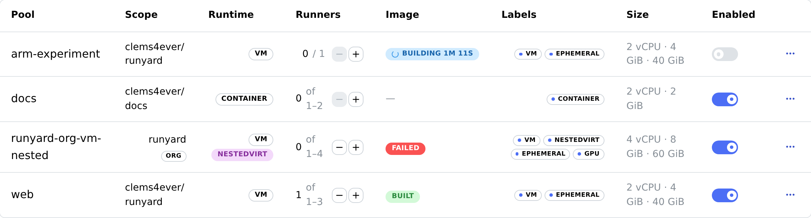
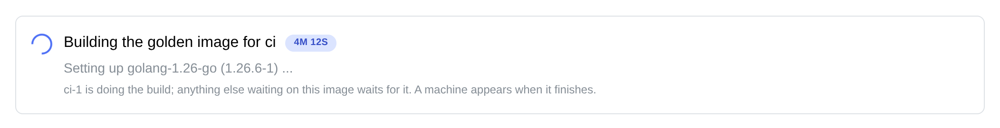
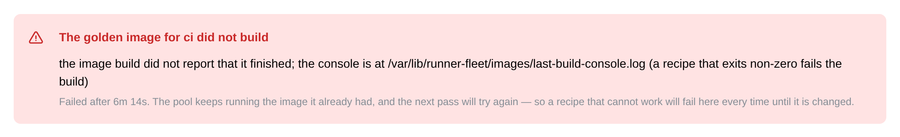
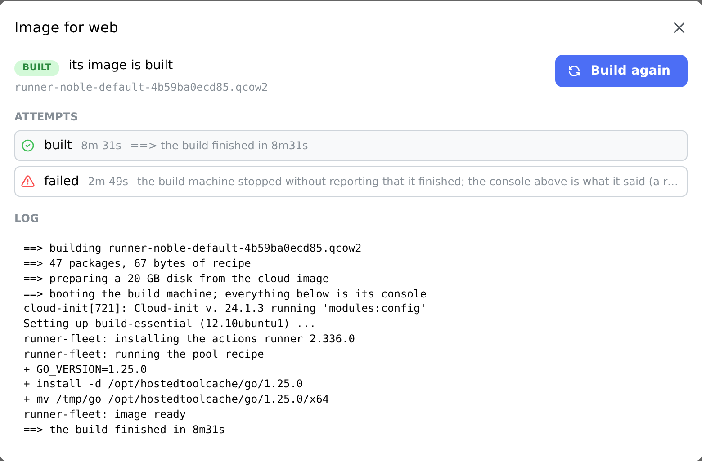

# runner-fleet

[](https://github.com/clems4ever/github-runner/actions/workflows/ci.yml)

A daemon that maintains a fleet of [self-hosted GitHub Actions
runners](https://docs.github.com/en/actions/hosting-your-own-runners) on one
host, with a web UI to configure it.

Each runner is a throwaway QEMU virtual machine or a Docker container. Per pool
you choose the repository or organisation, the runtime, whether jobs get
`/dev/kvm`, whether runners are ephemeral, what labels they register with, how
big they are — and how far the pool may scale itself when work arrives.

**Upgrading the daemon does not touch the runners.** It supervises nothing: the
runners are systemd units and Docker containers of their own, and the daemon
only creates, drains and deletes them. Restart it, upgrade it, or let it crash —
the jobs on this host carry on.


## Install

```bash
curl -fsSL https://raw.githubusercontent.com/clems4ever/github-runner/main/install.sh | sudo bash
```

It fetches the latest release, verifies its checksum, installs the systemd
unit, and asks for the user name and password the web UI will use. Then open
<http://127.0.0.1:8080>.

Rerunning it is how you upgrade, and it is deliberately uneventful.

If something else on the host already has port 8080, pick another — the
installer writes it into the unit, and later upgrades keep it:

```bash
curl -fsSL https://raw.githubusercontent.com/clems4ever/github-runner/main/install.sh \
  | sudo ADDR=127.0.0.1:8181 bash
```

The UI binds to the loopback address. If the host is remote, tunnel to it rather
than opening the port — the daemon holds a credential that administers your
repositories:

```bash
ssh -N -L 8080:127.0.0.1:8080 your-host
```

## Getting started

1. **Add a credential** — a GitHub App, or a personal access token. Either
   needs **Administration: Read and write** on the repositories it covers, or
   **Self-hosted runners: Read and write** on an organisation, and either is
   encrypted at rest and never shown again.
2. **Create a pool.** Pick the scope, the runtime, and the number of replicas.
3. Runners appear within a few seconds, and again after a reboot.

A pool named `web` with a maximum of three gives you `web-1`, `web-2` and
`web-3` when it is busy, and just `web-1` when it is not.

## What a pool decides

| | |
| --- | --- |
| **Scope** | one repository, or an organisation whose repositories all share the runners |
| **Runtime** | a virtual machine per job, or a container |
| **Nested virtualisation** | whether jobs get `/dev/kvm` and can boot machines of their own |
| **Ephemeral** | take one job, then be replaced by a clean runner |
| **Minimum runners** | what the pool keeps up when nothing is running, at least one |
| **Maximum runners** | how far it may grow under load; equal to the minimum for a fixed size |
| **Labels** | what a workflow targets with `runs-on` |
| **Size** | vCPUs, memory, and disk for VM pools |
| **Image** | for VM pools, what is baked into it: extra packages and a recipe |

Every runner also registers with labels describing what it is — `vm` or
`container`, plus `nestedvirt` and `ephemeral` when they apply — so a workflow
can ask for what it needs:

```yaml
jobs:
  build:
    runs-on: [self-hosted, nestedvirt]
```

Those follow the settings rather than the name, so a pool cannot claim to be
something it is not.

The nested virtualisation label used to be `nested`, which said nothing about
what was nested. A workflow still asking for `nested` will queue for ever;
change it to `nestedvirt`. The runners themselves need nothing done to them —
the label is part of what a runner is built from, so each is replaced with a
correctly labelled one as it finishes its current job.


### What a machine pool bakes in

A machine boots from a golden image built once on the host, and every runner in
the pool is a copy-on-write overlay on it. Anything already in that image costs
a job nothing; anything a job installs, it installs again on the next job, and
on every job after that.

Two fields decide what is in it. **Extra packages** are apt packages, added to
the ones every runner gets. A **recipe** is a shell script run as root while the
image is built, after the packages are in — for what apt cannot give: a
toolchain at a version no archive carries, a linter pinned to the version the
project is linted with, a warm build cache.

```bash
# Go, at the version go.mod declares, in the layout actions/setup-go looks in
# — so the step finds it and does nothing.
GO_VERSION=1.25.0
install -d /opt/hostedtoolcache/go/${GO_VERSION}
curl -fsSL "https://go.dev/dl/go${GO_VERSION}.linux-amd64.tar.gz" | tar -xz -C /tmp
mv /tmp/go /opt/hostedtoolcache/go/${GO_VERSION}/x64
touch /opt/hostedtoolcache/go/${GO_VERSION}/x64.complete
```

An image is named by everything it is built from — the release, the runner
version, the build script, the package list and the recipe — so the two fields
behave the way anyone editing them would hope:

- change either, and the daemon builds a new image; the pool's runners drain as
  they finish their jobs and come back on the new one
- change them back within a day, and the old image is still on the host, so
  nothing is rebuilt
- leave them alone, and no machine ever rebuilds anything

The recipe runs as root in a throwaway machine with no credential in it, and
what it writes is a disk every job in the pool will boot. It is not a place for
secrets: it is stored in the clear, and it ends up in an image any job can read.

A build that fails says so and stops. A recipe that exits non-zero fails the
build, the pool gets no runners, and nothing tries again until somebody asks or
the recipe changes. Both fields are for machine pools; a container pool names a
prebuilt image in its image field instead, and is refused these rather than
quietly ignoring them.

### Waiting for an image

**A machine pool takes no jobs until the image its runners boot has been
built.** That is the whole rule, and every pool says where it stands on its own
row:



The daemon builds it, once per host per image, before it creates a single
runner. Enabling a pool for the first time starts the build; a pool that is
switched off can be built ahead of time from the same panel, so that turning it
on is instant. Either way there is never a runner registered with GitHub on an
image that does not exist, and never a job running on the image the pool used to
ask for.

A build takes minutes and says what it is doing while it does them:



The first build on a host spends its first minutes fetching the image every
build starts from, with no machine booted and so nothing on a console to read.
That is reported as what it is, including that it happens once. After that the
log is the build machine's own console, copied in as it is printed — so the log
somebody is watching and the log that is kept are the same file.

When a build fails, the pool stays empty and says so, with the console that
explains it:



**It is not tried again on its own.** A recipe that cannot work should fail once
and wait, rather than rebuild every few seconds until somebody notices — which
is what a unit with a restart policy does, and what this used to be. There are
two ways forward and the panel names both: fix the recipe, which is a different
image and builds by itself, or press **Build now** to try the same one again.

Every attempt is kept, with its whole log, against the pool it was for:



That is what makes a fixed recipe reviewable in the morning: the failure is
still there, underneath the build that fixed it, and so is what each of them
printed. The last twenty attempts per pool are kept, and they go when the pool
does.

### Templates

Pools can be written down and imported, so a fleet is something a repository
carries rather than something rebuilt by hand on each host.

**Pools → Import**, paste a template or choose the file, pick the credential,
and press **Preview**. The preview is not a guess about what would happen: it
is the import itself, run against the database and rolled back, so a line
saying *new* is a pool that was created a moment ago and then undone. Press
**Import** underneath it and the same thing happens for real.

**Pools → Export** writes the fleet out in the same format, for the next host or
for the repository it serves.

A template carries nothing local to one installation — no pool ids, no
credential, no timestamps. The credential is chosen at import time, and the
scope can be replaced, so one document serves several repositories:

```json
{
  "version": 1,
  "name": "github-runner CI",
  "pools": [
    { "name": "ci-container", "runtime": "container", "minReplicas": 1, "maxReplicas": 3 },
    { "name": "ci-vm", "runtime": "vm", "cpus": 4, "memoryMb": 8192, "diskGb": 40 }
  ]
}
```

Anything left out takes the same default it has in the editor, except that a
pool is enabled and ephemeral unless it says otherwise. Importing over a pool
that already exists has to be asked for, and when it is, the pool keeps its
identity and its runners are replaced gracefully as each finishes its job.

[`templates/`](templates/) holds the ones shipped with the daemon, including the
two pools this repository's own CI needs. They are imported by the test suite,
so one that stops working fails the build rather than an operator's afternoon.

### Autoscaling

Set the minimum to 1 and the maximum to 5, and the pool sits at one idle runner
until work arrives.

**Growing.** GitHub does not publish how many jobs are queued for a set of
labels — only what each runner is doing. So demand is inferred: when *every*
runner in a pool is busy, the next job would have nowhere to go, and one more
runner is added. That is also why the minimum is never zero. A pool with no
runners has nothing to observe, so it could never learn that it should grow;
the idle runner is what makes the pool able to answer the question at all.

It grows one runner at a time, and the daemon comes back within seconds after a
scale-up rather than waiting for its next tick, so a burst ramps quickly without
a single long job conjuring a full fleet.

**Shrinking** is deliberately the slow direction. The pool returns to its
minimum only after five minutes with nothing busy, which rides out the gap
between one job and the next. Shrinking drains like every other change, and it
picks idle runners: a runner with a job on it is kept, not stopped and waited
on.

Minimum equal to maximum is a fixed-size pool that never moves — which is what
every pool was before this existed, and what an upgraded database keeps.

The fleet view says which pool is at what size and why: *every runner is busy*,
*quiet for 7m*, *spare capacity available*.

**Resizing without opening the editor.** Each row of **Pools** has a plus and a
minus next to its runner count. A step moves the pool's maximum, because the
maximum is the number that says how big the pool may get; on a fixed-size pool
the minimum comes with it, so the pool stays fixed. Neither button will step a
pool onto its own floor — turning autoscaling on or off is a decision for the
editor, not a side effect of a click. Growing applies straight away; shrinking
asks first, and says how many runners it would drain.

### Activity

The daemon records what it observed on every pass and keeps two days of it, so
the fleet view can show what has been happening rather than only what is
happening now. The filled area is work actually running; the line above it is
how many runners existed to run it — one axis, both counting runners — so a
pool scaling up reads as the line stepping out to meet the area, and settling
back when the work stops.


Each point is the **peak** of its interval, not the mean: a burst that filled
the fleet for two minutes is the thing worth seeing, and averaging over a
ten-minute bucket would flatten it into nothing. Narrow it to a single pool
with the filter, or leave it on the whole fleet.

### Jobs

Activity shows the last two days minute by minute. The **Jobs** page is the
other question: how much work each pool has actually done over a quarter, which
is what you argue about when deciding whether a pool needs to be bigger.

Two numbers per pool. **Jobs** is how many the pool has been asked for. **Time
on jobs** is what that took in *runner-time* — two runners busy for a minute is
two minutes — which is the figure a pool would have had to be bigger to absorb.
A pool sitting at the top of the table with a mean job of six seconds and a
pool with the same total made of hour-long builds are different problems.

The tally is kept per pool per UTC day and held for ninety days, so it survives
the two-day activity window by a wide margin. Deleting a pool does not erase
what it ran; the row stays, marked, because the host paid for that work either
way.

**These are observations, not GitHub's own accounting, and the page says so.**
The daemon never sees a job. It asks GitHub what each runner is doing once per
reconcile pass — every thirty seconds by default, `--interval` moves it — and a
job is a runner with work on it that had none last time it looked. That has
consequences worth knowing:

- A job that starts and finishes inside one pass is never counted at all.
  Shorten `--interval` and fewer are missed.
- Time is a sum of intervals, not a stopwatch: a job is charged in whole passes.
- Two jobs run back to back on the same runner with no idle pass between them
  count as one. Ephemeral runners, replaced after every job, cannot do this.
- A gap between passes longer than ten minutes is not counted at all. A daemon
  that was stopped for an hour did not watch an hour of work, and saying it did
  would be worse than saying nothing.
- Restarting the daemon loses which runners were busy, so jobs in flight are
  counted once more when it comes back.

Good enough to size a pool from over weeks. Not an invoice.

### How quickly a machine comes back

An ephemeral runner is replaced after every job, so the turnaround is paid once
per job. It is about half a minute, and it is worth knowing what it is made of:

| | |
| --- | --- |
| systemd's restart delay | 2s |
| overlay disk, runner configuration, seed image | 1–2s |
| the guest booting to *Listening for Jobs* | ~16s |

The image is built for that: a machine boots for one job and is destroyed, so
the services a stock cloud image starts and a runner never uses — snapd, modem
and disk managers, the daily apt timers — are turned off in the golden image.

If half a minute matters for your pool, the lever is **capacity, not speed**.
A pool whose minimum is two always has a registered machine waiting while the
other one recycles, so a queue never pays the turnaround at all. Turning
**ephemeral** off is the other end of that trade: the machine is reused between
jobs and the boot disappears entirely, at the cost of a job seeing what the
last one left behind.

### Resources

The **Resources** page is what the host is actually doing, as opposed to what
its pools were promised. Three meters — processor, memory, and the filesystem
holding the state directory, which is the one golden images and machine disks
fill — over a chart of the same three across the last day, and under it a row
per runner.

Everything is read from the kernel, and each runtime is measured the way that
runtime can be measured. A **container** is asked of Docker. A **machine** is
asked of systemd: every runner is a unit, every unit is a cgroup, and the
accounting is already there — so nothing has to be read out of the guest, and a
machine that has wandered off into swap is still counted. Both then have the
page cache taken out of the figure, which is what makes a container that has
cloned a large repository look about to die when it is fine, and matters more
still for a machine: QEMU reads its disk through the host's cache, so a machine
that has done nothing but boot is charged for the image it booted from. The
subtraction happens in one place for both, because the two are shown side by
side under one heading and a column that means something different from the one
beside it is worse than a column that is merely wrong.

Processor figures are a share of the whole host, the same scale the meters use,
so a runner's number and the host's can be read against each other. A runner
that has only been seen once shows a dash rather than a zero: a rate needs two
readings, and a machine that is busily booting is not idle.

A machine still costs more than a container at rest, and about a gigabyte of it
is real: a guest boots a whole distribution, starts its own Docker daemon and
its own runner, and none of that is shared with the host. Guests are given a
balloon that reports free pages, so memory a job finishes with goes back to the
host rather than staying resident until the machine is replaced — but a guest's
own page cache is not free memory, and no amount of reporting reclaims it. The
floor is the floor. What the balloon prevents is the ratchet above it.

Beneath them is what the pools have **committed** — what they would take if
every one of them grew to its ceiling at the same moment. That is arithmetic on
the configuration rather than a measurement, and it is the number a quiet fleet
hides: a host at four per cent can still be promising three times the machine it
is on. Over-committing is not flagged as a fault, because it is usually
deliberate; it is stated, and left to you.

Readings are taken every fifteen seconds — `--resource-interval` moves that —
and two days of them are kept, on the same retention as the activity history.
Each point on the chart is the peak of its interval, for the same reason.

### The fleet budget

A pool's size is per runner. The commitment above is what happens when that is
all you have: pools sized for their busiest hour, and no answer to what the host
does when every one of them has its busiest hour at once.

The **fleet budget**, on the Settings page, is the ceiling over all of them
together. It is two things at once, and it needs to be both.

On the host, every machine runner is a systemd unit inside one slice —
`runner-fleet.slice` — and the budget is that slice's limits. The kernel
accounts for the group, so ten idle machines leave their share to the one that
is building, and no machine can take the host because the group it is in has
already spent everything. This is enforcement, and it does not care whether the
daemon is running.

In the daemon, the same figures stop pools growing into a ceiling they would
only be squeezed against. Without that, a host at its limit would keep creating
machines that make every machine already on it worse, for ever, because nothing
in the autoscaler has any idea the ceiling exists. Growth above the minimums is
shared out a runner at a time, in name order, so a large pool does not empty the
budget before a small one is looked at — and the pool that stops says so, on the
Pools page, in the terms the budget was set in.

**Minimums are never broken.** A pool with no runner cannot accept a job, so it
can never discover that it needs one: a budget that scaled pools to nothing
would not slow the fleet down, it would switch it off. If the minimums alone
exceed the budget they are paid anyway, the slice contains the result, and every
pool says which of the two problems this is.

| | |
| --- | --- |
| **CPU** | processors across every machine together, as `CPUQuota` on the slice. Throughput, not a set of cores |
| **Memory** | MiB across every machine together, as `MemoryHigh` |
| **Disk** | GiB across the machines' disks and the golden images underneath them. Not enforced by the slice — see below |
| **Share when contended** | `CPUWeight`: what the fleet gets when something else on this host wants the machine too. Not a cap — a fleet with only this set may still use the whole host |
| **Kill at the ceiling** | off by default. See below |

Memory is applied as pressure rather than as a wall. Past `MemoryHigh` the
kernel reclaims from the fleet harder and the fleet gets slower; it does not
fail anything. The alternative is `MemoryMax` and the out-of-memory killer,
which picks the largest machine in the group rather than the one that overspent
— so it costs somebody their job, and not necessarily the person whose job
caused it. That is the switch, it is off, and turning it on puts `MemoryMax`
five per cent above the ceiling so the reclaim has somewhere to happen first.

**Disk is the one the slice cannot hold.** There is no disk equivalent of
`CPUQuota`, and it is also the dimension that behaves least like the other two:
processors and memory come back the moment a machine stops, and disk does not. A
machine's disk grows as its job writes and is only freed when the machine is
destroyed; a golden image is not freed at all. So the ceiling is held from two
sides in the daemon instead — it does not start the machine that would cross it,
and it collects golden images to get back underneath.

**Golden images are collected.** An image no pool asks for and no machine is
booting is deleted after a day. The day is deliberate: the usual reason an image
goes unwanted is somebody editing a recipe and putting it back, and that round
trip is minutes where a rebuild is tens of them. Past the disk ceiling the grace
does not apply and the oldest unwanted images go first, only as many as it takes
to fit. Two things are never collected whatever the ceiling says: an image a
pool asks for, and an image something is booting — including the ones further
down a backing chain, read from the machines' own disks rather than from
anything the daemon remembers, so a restart does not lose track of them. If that
cannot be read at all, nothing is collected; a full disk is a bad afternoon, and
deleting an image out from under a running job is somebody's job.

Machines that were killed rather than stopped — a host crash, the out-of-memory
killer, `kill -9` — used to leave their disks behind for ever, because the only
thing that ever deleted one was the machine itself on the way out. The daemon now
sweeps them at startup, which is the one moment nothing it started is running:
a directory belonging to no runner it knows about, that no process has open, is
gone.

Changing the budget applies to the machines that are already running: the limits
are properties of a group that already holds them. Lowering it drains the excess
rather than killing it, so no job is lost either way. Machines run inside the
slice whether or not a budget is set — a unit joins its slice when it starts, so
if membership were conditional, setting a budget would mean replacing the whole
fleet before it meant anything. The one consequence: machines that were already
running when a host first upgraded to a version that writes the slice stay
outside it until they are next replaced, and the Resources page names them while
that is true.

The daemon itself is deliberately not in the slice. A fleet pressed against its
memory ceiling must not be able to take down the only thing that can raise it.

**Container pools are not covered.** They are not in the slice, so they are not
charged against it either — a figure that meant "machines, and also containers
that are not subject to it" would mean nothing.

### Virtual machines or containers

A **virtual machine** gives a job its own kernel, its own Docker daemon, a disk
that is thrown away afterwards, and passwordless `sudo` — a workflow written for
a GitHub-hosted runner runs unchanged. It boots in seconds from a golden image
built once per host.

A **container** starts faster and costs less, and is a weaker boundary: a job
shares the host kernel. Nested virtualisation in a container means handing the
job the host's `/dev/kvm`, which is a real hole in an already weaker boundary.
Both are offered; the UI says which is which.

The two also differ in what the runner is trusted with. A machine keeps the
credential and registers itself at every boot, which is what lets it come back
after a reboot with the daemon still down — the job is inside the guest and
never sees it. A container shares everything with its job, so it is given only
what the daemon minted for that one runner. The cost is that containers are
replaced by the daemon rather than restarted by Docker, so a container that
finishes a job while the daemon is down waits for it to come back.

### How a runner registers

An **ephemeral** runner is registered just in time: the whole configuration —
name, labels, group, and the credential the runner listens with — is minted on
the host by a single call to GitHub, handed to the runner, and spent on the
first job. Three things follow from that, and they are the reason it is the
default:

- Nothing inside the runner can administer a repository. A registration token
  is short-lived, but for its lifetime anyone holding it can register runners;
  a just-in-time configuration is one runner that takes one job.
- There is no `config.sh` step, so there is no half-registered runner to clean
  up when it fails.
- A runner that is minted and never boots leaves nothing behind on GitHub.
  Under a registration token the entry appears when the guest configures
  itself, which is what left offline runners on a repository after a host went
  down mid-boot.

A **non-ephemeral** runner cannot use one. GitHub only mints a configuration
for a runner that takes a single job and is spent, which is the opposite of a
pool kept up across jobs, so those still register with a token — minted by the
daemon for a container, and by the machine itself for a VM.

A configuration is spent by the job it took, so a machine mints its own at
every boot rather than being handed one that has to survive a restart. That is
what keeps the guarantee above: a machine that comes back with the daemon down
registers from the credential it keeps, and a machine restarted by systemd
after a job gets a fresh configuration instead of replaying a used one.

The registration path is covered by tests that talk to real GitHub, because a
fake server can only confirm that the client sends what this repository thinks
GitHub wants. They are skipped unless told where to run:

```
FLEET_LIVE_TOKEN=… FLEET_LIVE_REPO=owner/name go test ./internal/github -run Live
```

The token needs `Administration: read and write` on that repository, which is
what minting a configuration requires. Every runner they register is
deregistered again, under a name nothing else would choose.

Container images are expected to carry the GitHub Actions runner. The official
`ghcr.io/actions/actions-runner` works as it is; a custom image is found by
looking for `config.sh`, or told where to look with `FLEET_RUNNER_HOME` — which
is where the runner is started from either way.

## How the daemon works

It is a reconciler. The database holds what you asked for; systemd and Docker
hold what exists; every pass compares the two and acts.

```
pools in SQLite  ──►  Plan(desired, actual, GitHub)  ──►  create / start / drain / remove
                            ▲              ▲
                   systemd + Docker    is a job running?
```

Three properties fall out of that, and each has tests that would fail loudly if
it stopped being true:

- **A restarted daemon adopts the fleet.** It has no memory. It reads the
  runners back from the host's environment files and container labels, and if
  they match what the pools ask for it does nothing at all.
- **No change ever fails a job.** Scaling down, editing a pool, rotating a
  token or deleting a pool all *drain*: the runner is asked to stop, finishes
  the job it is on, and only then is removed. Draining a machine is an ACPI
  shutdown, which the guest turns into a clean stop of the runner; the unit
  waits up to an hour for it.
- **A busy runner is never removed.** The host says whether a machine is up;
  only GitHub knows whether a job is on it, and the daemon asks — including for
  runners whose pool has just been deleted, which carry their own scope for
  exactly that reason.

The fleet view shows both facts side by side, because they answer different
questions:


Each runner's configuration is hashed into a *generation*. A runner whose
generation no longer matches its pool is running the wrong configuration and is
replaced, gracefully. The scaling bounds deliberately are not part of that hash:
the autoscaler moves them many times an hour, and that must never replace a
runner that is already correct.

The hash also carries a build revision, raised when a release changes *how* the
daemon builds a runner rather than what you asked for. Without it, an upgrade
that fixes the building would leave every existing runner on the broken recipe,
since the pool hashes the same before and after — which is exactly what happened
once, and cost an afternoon of deleting containers by hand.

## Credentials

A **GitHub App** is the better of the two, and what the form offers first:

- Nothing expires on a calendar. The daemon signs a short assertion with the
  app's key and exchanges it for an installation token that lives an hour, and
  it does that again whenever it needs to.
- The repositories it can reach are a list you edit on GitHub, not a token you
  regenerate.
- Uninstalling the app revokes everything on this host at once.


Setting one up, in full:

1. Register an App under your account — **Settings → Developer settings →
   GitHub Apps → New GitHub App**.
2. Set **Where can this GitHub App be installed?** to **Only on this account**.
   It never becomes public and nobody else can install it.
3. Under **Webhook**, deselect **Active**. This app is a credential, not an
   integration, and nothing on your host has to be reachable from the internet:
   the daemon only ever makes outbound calls.
4. Give it **Repository permissions → Administration: Read and write** (or, for
   an organisation, **Organization permissions → Self-hosted runners: Read and
   write**).
5. **Homepage URL** is a required field but only a link — GitHub never fetches
   it. Point it anywhere.
6. Generate a private key, install the app, and choose the repositories it may
   use. Paste the app id and the `.pem` into runner-fleet.

A **personal access token** still works everywhere an app does; a pool cannot
tell the difference. Existing installations keep the token they have.

Rotating either — a new key, a new token — replaces the runners using it,
gracefully, as each finishes the job it is on.

## Security

- The web UI is HTTP Basic over a loopback bind, with bcrypt and attempt
  throttling. Until a password is set, the daemon serves nothing.
- Credentials are encrypted with AES-256-GCM under a key in
  `/etc/runner-fleet/master.key` (0600, root, generated on first start). The
  daemon has to decrypt to use them, so this is not protection against root: it
  protects backups, snapshots and disks that travel where the key does not.
- The decrypted copy a runner needs lives in `/run/runner-fleet`, which is a
  tmpfs. It never reaches a disk, and a runner can still register itself after
  a reboot with the daemon still starting — for an app that means the private
  key is there, and the agent does its own token exchange. That is the cost of
  runners that do not depend on the daemon: losing the host means uninstalling
  the app to revoke it.
- GitHub recommends self-hosted runners only for **private** repositories: on a
  public one, a pull request from a fork can run arbitrary code on the runner.
  A VM is a much harder boundary than a container, and ephemeral runners give
  each job a clean machine.

## Layout on the host

| | |
| --- | --- |
| `/usr/local/bin/runner-fleet` | the daemon, the agent and the CLI, in one binary |
| `/etc/runner-fleet/fleet.db` | pools and credentials |
| `/etc/runner-fleet/master.key` | the encryption key |
| `/etc/runner-fleet/runners/` | one environment file per VM runner |
| `/run/runner-fleet/credentials/` | decrypted tokens, on tmpfs |
| `/var/lib/runner-fleet/` | golden images, their build logs, and VM disks |
| `/var/lib/runner-fleet/images/logs/` | the whole log of each image build, one file per attempt |
| `/var/lib/runner-fleet/consoles/` | the last console of each machine, kept after it is gone |
| `gh-runner@NAME.service` | one runner |
| `runner-fleet.slice` | the group every machine runner is in, and where the fleet budget's limits live |
| `runner-fleetd.service` | the daemon, in `system.slice` and deliberately outside the budget |

## When a runner will not come up

The Fleet page says `failing` beside a runner the host is refusing to keep
running, with what went wrong and the command that explains it. Two places have
the detail:

```bash
sudo journalctl -u gh-runner@web-1 -n 50     # the agent, on the host
sudo cat /var/lib/runner-fleet/consoles/web-1.log   # inside the machine
```

A machine is rebuilt from scratch on every start, so its console would go with
it — the last one is kept there instead, which is the only account of what
happened inside a machine that has already gone.

To look inside a machine that is still up, the daemon keeps a key for exactly
that. The port is in the agent's log line for that runner:

```bash
journalctl -u gh-runner@web-1 | grep booting        # ssh_port=43209
ssh -i /var/lib/runner-fleet/ssh/id_ed25519 -p 43209 ubuntu@127.0.0.1
systemd-analyze blame | head            # where a boot went
journalctl -u github-runner              # the runner itself
```

A machine that powers off without its runner ever being able to take a job is
reported as a failure rather than treated as a runner finishing, so a fleet that
is looping does not look like a fleet that is working.

## Cutting a release

**Actions → release → Run workflow**, and pick `patch`, `minor` or `major` — or
type an exact version. It runs the suite first and only tags if that passes, so
a failed release leaves no tag behind, then builds both architectures and
publishes the archives with their checksums.

A tag pushed by hand does the same thing:

```bash
git tag v0.2.0 && git push origin v0.2.0
```

Releases are cut from `main`; the workflow refuses to run anywhere else.

## Development

```bash
make ui        # build the web interface into the Go module
make build     # build the binary
make test      # go vet + go test
make ui-test   # vitest
make dev       # run against ./tmp, no root, nothing on the real host
```

The UI runs on its own with `npm --prefix web run dev`, proxying to the daemon
on 8080.

Tests cover everything that does not need a hypervisor: the reconciler's rules
as table tests against fake executors, the rendered units and container specs,
the API including every authentication path, encryption, and end-to-end runs
that drive the daemon over HTTP against a real database. Booting a guest needs
`/dev/kvm`, which hosted CI runners do not have, so that stays a manual check.

## Roadmap

**Prebuilt images.** A pool builds its image on the host that needs it, once.
That is the right trade for one host and the wrong one for ten, which would each
spend the same minutes building the same disk. A pool naming an image by URL and
digest would let CI build it once and every host pull it.

## Licence

[MIT](LICENSE)
